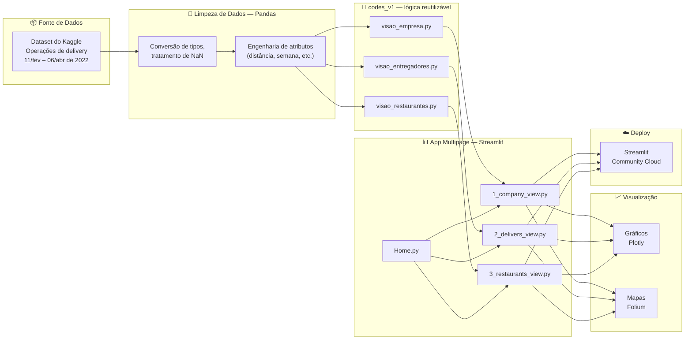
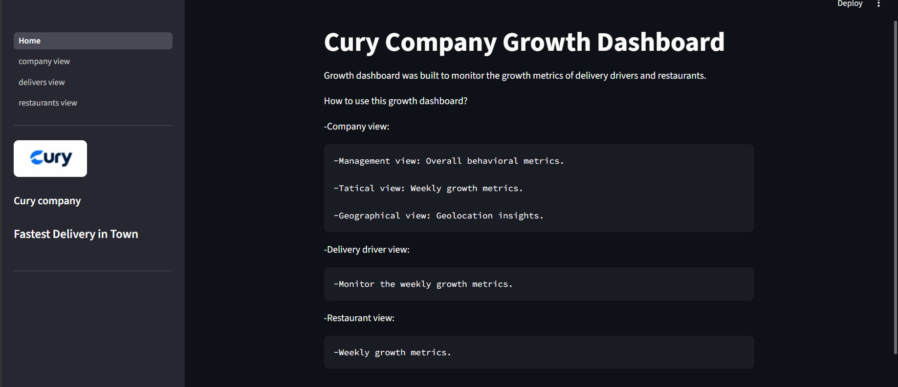
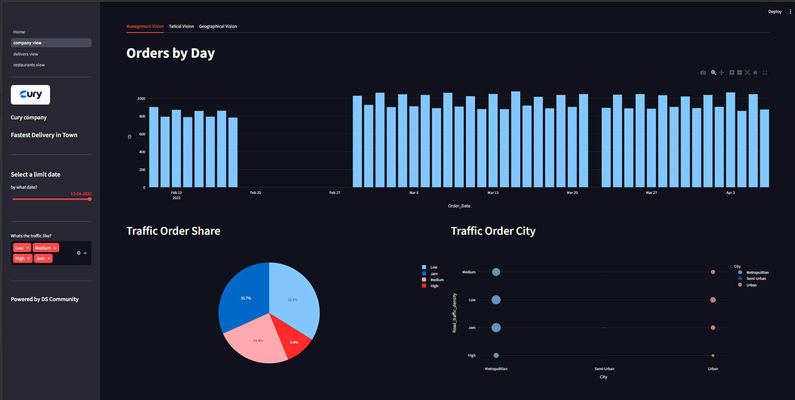
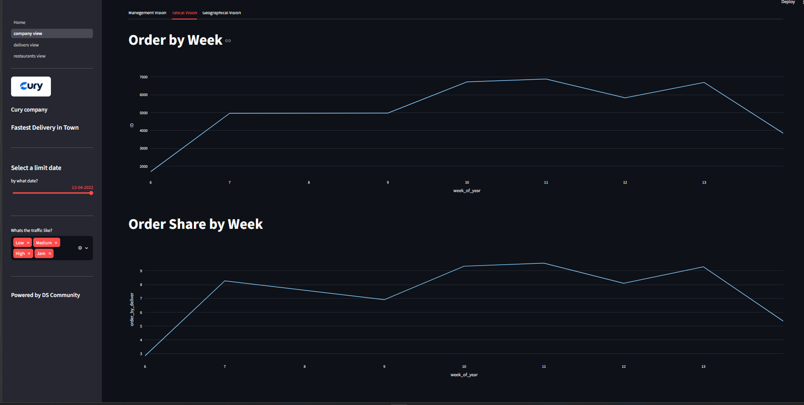
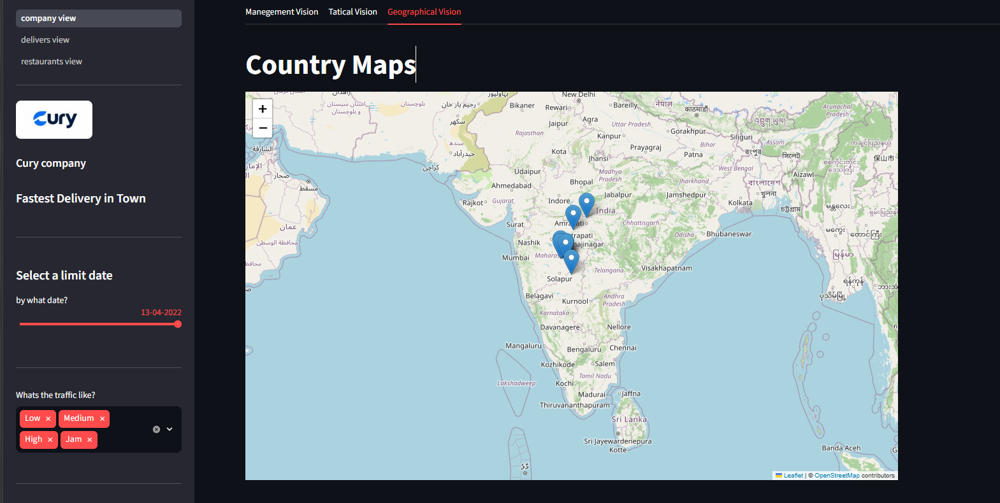
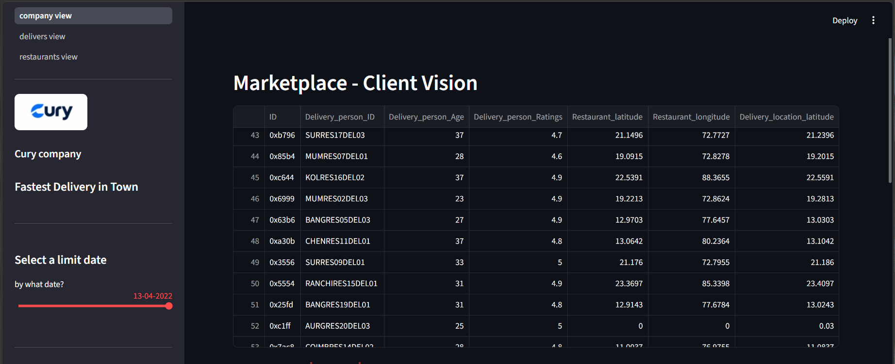
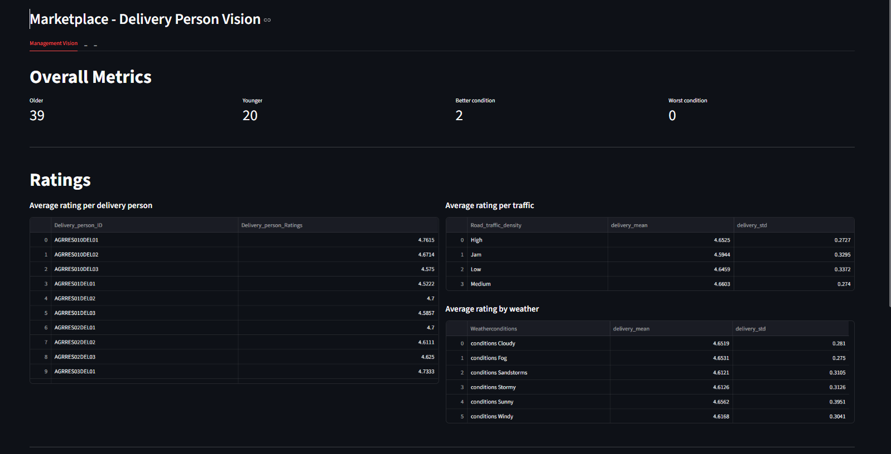
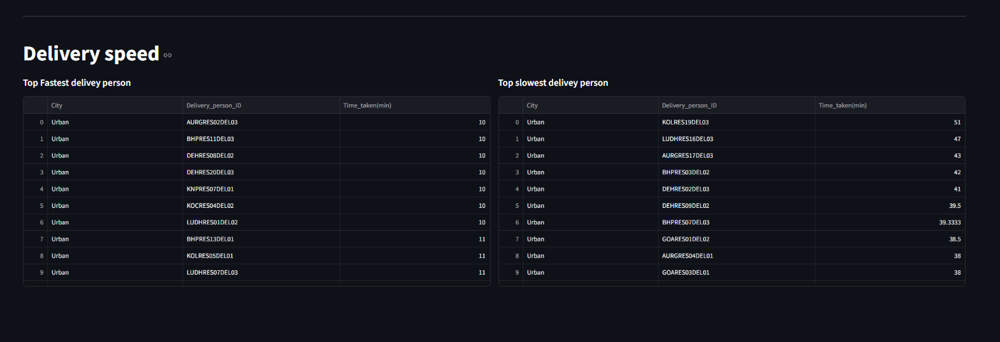
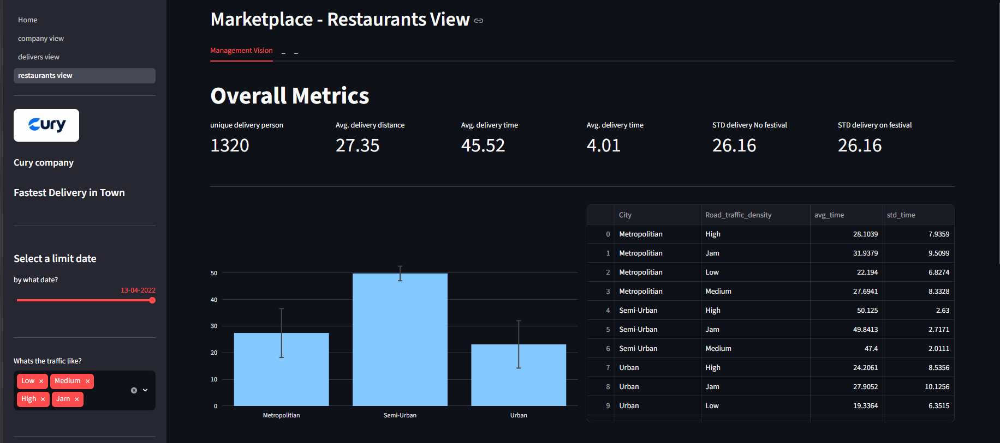
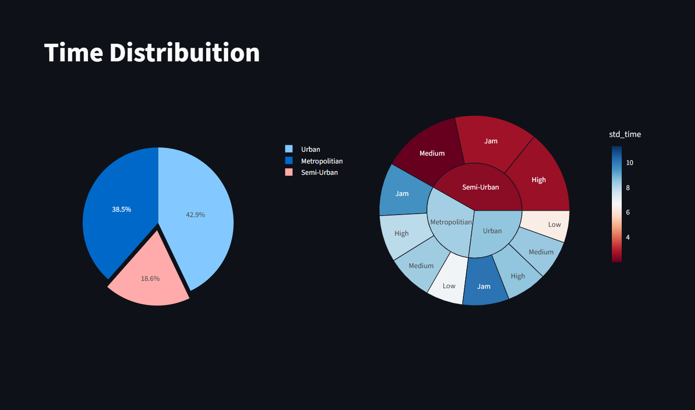

# Delivery Marketplace Growth Dashboard


Dashboard de Business Intelligence de ponta a ponta, construído com Python, Streamlit, Plotly, Pandas e Folium para monitorar KPIs estratégicos de um marketplace de delivery de comida.

---

## 1. Problema

A Cury Company é uma empresa de tecnologia que desenvolveu uma plataforma conectando restaurantes, entregadores e clientes. Os clientes fazem pedidos em restaurantes cadastrados e recebem a entrega em casa por entregadores cadastrados.

A plataforma gera uma grande quantidade de dados operacionais — informações de entrega, tipos de pedido, condições climáticas, avaliações de entregadores, entre outros — mas o CEO não tem uma visão centralizada dos principais indicadores de desempenho (KPIs) da empresa.

**Objetivo:** consolidar os KPIs estratégicos da empresa em um único dashboard interativo, permitindo que o CEO monitore a performance do negócio e apoie decisões orientadas a dados, sob três perspectivas de stakeholders:

| Visão | Responde |
|---|---|
| **Empresa** | Pedidos por dia/semana, distribuição de tráfego, pedidos por cidade, concentração geográfica dos pedidos |
| **Entregador** | Entregador mais novo/mais velho, condição do veículo, avaliações por trânsito/clima, entregadores mais rápidos/lentos por cidade |
| **Restaurante** | Entregadores únicos, distância/tempo médio de entrega por cidade, tipo de pedido e trânsito, tempo de entrega durante festivais |

---

## 2. Arquitetura



**Premissas:**
- Dados coletados entre **11 de fevereiro de 2022** e **6 de abril de 2022**.
- Modelo de negócio assumido: **Marketplace**.
- A análise cobre três perspectivas de negócio: Empresa, Restaurantes, Entregadores.

---

## 3. Stack

| Camada | Ferramenta |
|---|---|
| Linguagem | Python |
| Manipulação de dados | Pandas |
| Gráficos | Plotly |
| Mapas | Folium |
| App / Interface | Streamlit (multipage) |
| Versionamento | Git, GitHub |
| Deploy | Streamlit Community Cloud |

**Skills demonstradas:** Análise Exploratória de Dados (EDA), Limpeza de Dados, Visualização de Dados, Design de KPIs, Business Intelligence, Análise Geoespacial, Desenvolvimento de Dashboard, Relatórios Executivos.

---

## 4. Implementação

### Home



Página inicial com um guia rápido de como navegar pelas três visões principais do dashboard.

### Visão Empresa



Visão Gerencial: volume diário de pedidos ao longo do tempo, distribuição de participação por tráfego e volume de pedidos por cidade e condição de tráfego.



Visão Tática: total de pedidos por semana e média de pedidos por entregador por semana.



Visão Geográfica: centro geográfico de cada cidade, segmentado por condição de tráfego, exibido em um mapa interativo.



Tabela de dados brutos mostrando registros individuais de entrega, incluindo ID do entregador, idade, avaliação e coordenadas de restaurante/entrega.

### Visão Entregador



Métricas gerais (entregador mais velho/mais novo, melhor/pior condição de veículo) além da avaliação média por entregador, condição de tráfego e condição climática.



Top 10 entregadores mais rápidos e top 10 mais lentos por cidade.

### Visão Restaurante



Métricas gerais (entregadores únicos, distância média, tempo médio de entrega e desvio padrão com/sem festivais) além do tempo médio de entrega por cidade e condição de tráfego.



Distribuição do tempo de entrega por tipo de cidade e desvio padrão do tempo de entrega por cidade e condição de tráfego.

### Estrutura do Projeto

```
PYTHON_PROJECT_DA/
├── dataset/          # dados brutos e tratados
├── codes_v1/         # scripts Python auxiliares
├── dashboards/        # assets e visões do dashboard
├── images/            # imagens usadas no projeto e no README (inclui cury.png)
├── pages/              # páginas do app multipage do Streamlit
├── Home.py             # ponto de entrada principal do Streamlit
├── requirements.txt
└── README.md
```

> Nota: `.ipynb_checkpoints/` é uma pasta de cache local do Jupyter e é excluída do versionamento via `.gitignore`.

### Dashboard ao Vivo

Hospedado na nuvem, acessível de qualquer dispositivo conectado à internet:

🔗 https://curycompany1.streamlit.app/

---

## 5. Resultado

### Top 3 Insights de Negócio

1. A demanda de pedidos segue uma forte sazonalidade diária, com aproximadamente **10% de variação** entre dias consecutivos.
2. Cidades Semi-Urban não apresentam condições de **tráfego baixo (Low)**.
3. A maior variabilidade no tempo de entrega ocorre em condições de clima **ensolarado (Sunny)**.

### Conclusão

Este projeto consolida com sucesso os KPIs estratégicos da empresa em um único dashboard, oferecendo aos executivos uma visão abrangente da performance do negócio. A partir da Visão Empresa, a análise indica um aumento consistente no volume de pedidos entre a Semana 06 e a Semana 13 de 2022.

### Próximos Passos

- Simplificar o dashboard reduzindo o número de métricas exibidas.
- Adicionar novas opções de filtro.
- Expandir o dashboard com perspectivas de negócio adicionais.
