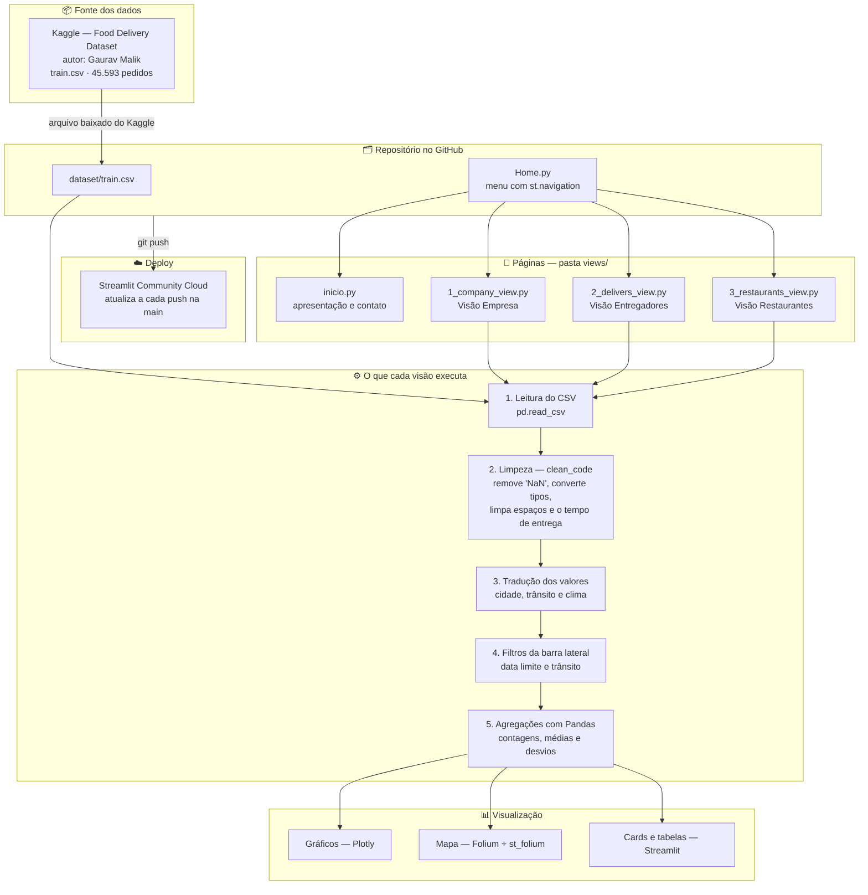
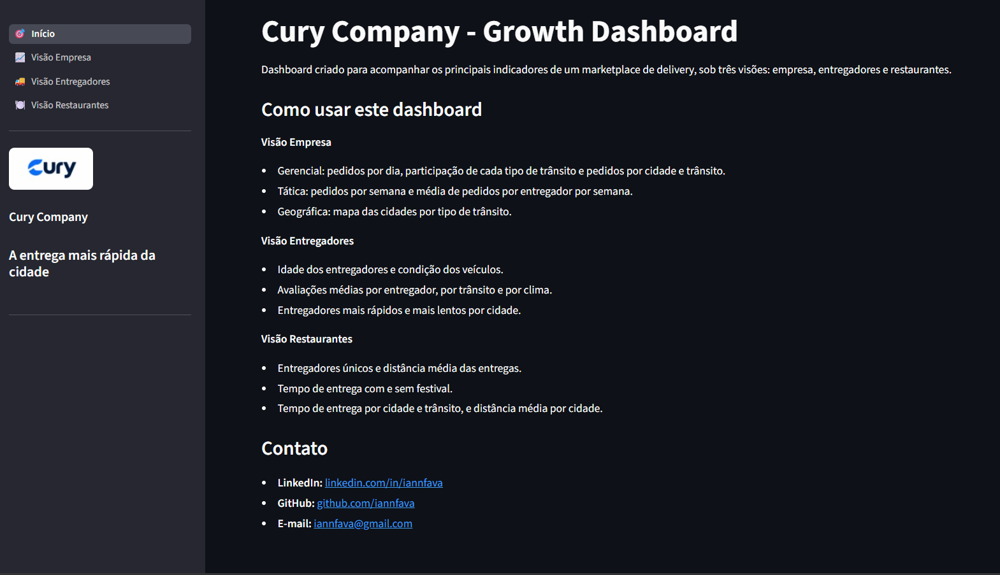
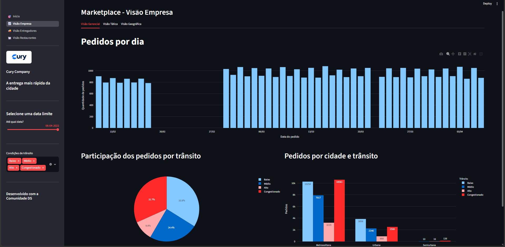
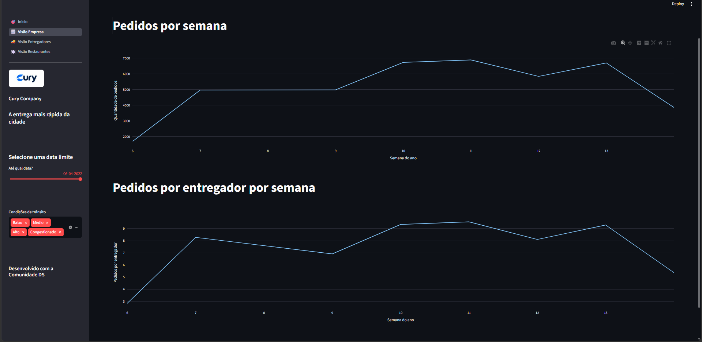
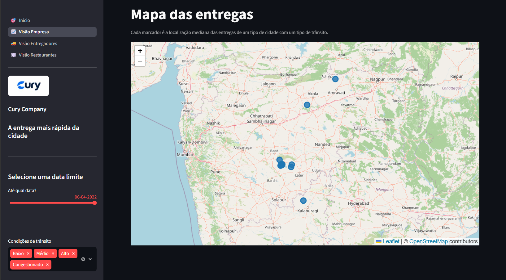
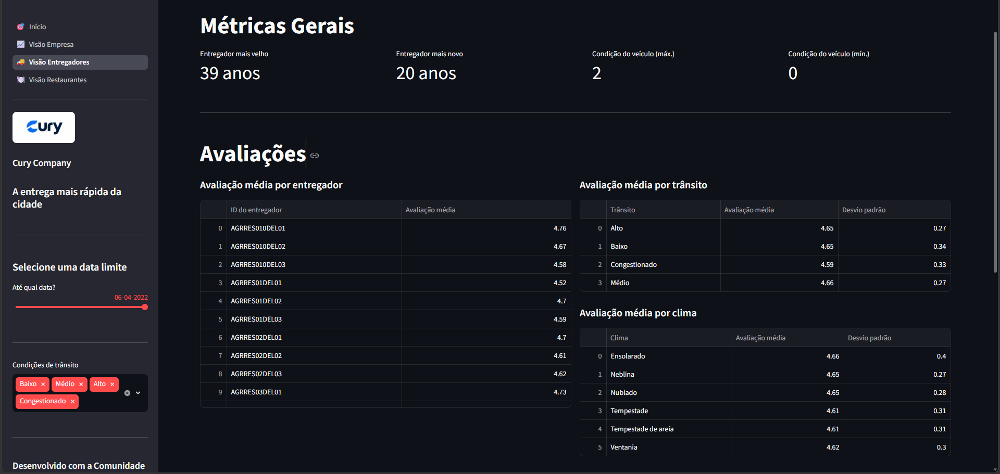
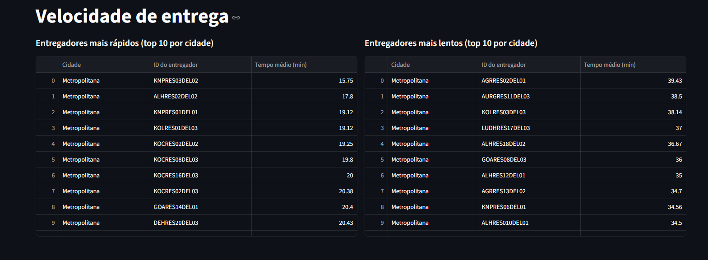
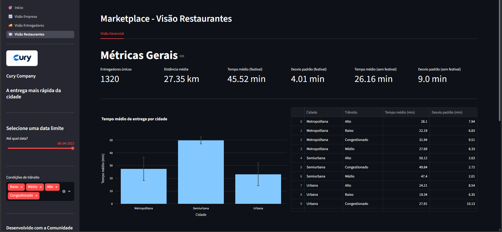
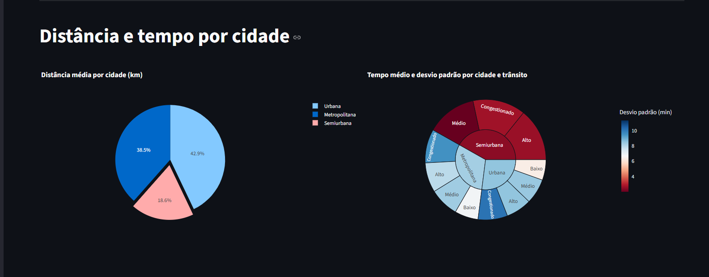

# Cury Company : Growth Dashboard


Dashboard em **Python + Streamlit** com os principais indicadores de um marketplace de delivery de comida, sob três visões: **empresa, entregadores e restaurantes**.

🔗 **Dashboard online:** https://curycompany1.streamlit.app


- Dados reais de **45.593 pedidos** de delivery na Índia (Kaggle), de 11/02/2022 a 06/04/2022.
- Limpeza e agregações com **Pandas**, gráficos com **Plotly**, mapa com **Folium**, app com **Streamlit**.
- Publicado no **Streamlit Community Cloud**, com atualização automática a cada push.


---

## 1. Problema

A Cury Company é uma plataforma que conecta restaurantes, entregadores e clientes. Ela gera muitos dados operacionais (pedidos, trânsito, clima, avaliações), mas o CEO não tem uma visão centralizada dos indicadores do negócio.

**Objetivo:** reunir os KPIs em um único dashboard interativo, organizado pelas três visões do marketplace:

| Visão | Perguntas que responde |
|---|---|
| **Empresa** | Quantos pedidos por dia e por semana? Como os pedidos se dividem por tipo de trânsito e de cidade? Onde ficam as entregas no mapa? |
| **Entregadores** | Qual a faixa de idade e a condição dos veículos? Como variam as avaliações por trânsito e clima? Quem são os entregadores mais rápidos e mais lentos por cidade? |
| **Restaurantes** | Quantos entregadores únicos? Qual a distância média das entregas? Quanto tempo leva uma entrega com e sem festival, por cidade e por trânsito? |

---

## 2. Arquitetura


```mermaid
flowchart TB
    subgraph Fonte["📦 Fonte dos dados"]
        A["Kaggle — Food Delivery Dataset<br/>autor: Gaurav Malik<br/>train.csv · 45.593 pedidos"]
    end

    subgraph Repo["🗂️ Repositório no GitHub"]
        B["dataset/train.csv"]
        C["Home.py<br/>menu com st.navigation"]
    end

    subgraph Paginas["📄 Páginas — pasta views/"]
        P0["inicio.py<br/>apresentação e contato"]
        P1["1_company_view.py<br/>Visão Empresa"]
        P2["2_delivers_view.py<br/>Visão Entregadores"]
        P3["3_restaurants_view.py<br/>Visão Restaurantes"]
    end

    subgraph Processo["⚙️ O que cada visão executa"]
        D["1. Leitura do CSV<br/>pd.read_csv"]
        E["2. Limpeza — clean_code<br/>remove 'NaN', converte tipos,<br/>limpa espaços e o tempo de entrega"]
        F["3. Tradução dos valores<br/>cidade, trânsito e clima"]
        G["4. Filtros da barra lateral<br/>data limite e trânsito"]
        H["5. Agregações com Pandas<br/>contagens, médias e desvios"]
    end

    subgraph Saida["📊 Visualização"]
        I["Gráficos — Plotly"]
        J["Mapa — Folium + st_folium"]
        K["Cards e tabelas — Streamlit"]
    end

    subgraph Deploy["☁️ Deploy"]
        L["Streamlit Community Cloud<br/>atualiza a cada push na main"]
    end

    A -->|"arquivo baixado do Kaggle"| B
    C --> P0
    C --> P1 & P2 & P3
    P1 & P2 & P3 --> D
    B --> D
    D --> E --> F --> G --> H
    H --> I & J & K
    Repo -->|"git push"| L
```

**Como ler o diagrama:** o `Home.py` só monta o menu. Cada uma das três visões lê o `train.csv`, limpa os dados, traduz os valores para português, aplica os filtros escolhidos na barra lateral e gera seus próprios gráficos. A página Início é só texto. O mapa é usado apenas na Visão Empresa.

**Decisão de projeto (e limitação conhecida):** cada visão repete a leitura e a limpeza dos dados. Isso deixa cada página independente, mas duplica código. Centralizar essa etapa está nos próximos passos.

---

## 3. Stack

| Camada | Ferramenta | Para que foi usada |
|---|---|---|
| Linguagem | Python 3.12 | Todo o projeto |
| Dados | Pandas, NumPy | Limpeza, filtros, agregações |
| Distância | Haversine | Distância em linha reta (km) entre restaurante e local de entrega |
| Gráficos | Plotly | Barras, linhas, pizza e sunburst |
| Mapa | Folium + streamlit-folium | Mapa interativo da Visão Empresa |
| App | Streamlit | Interface, filtros e menu (`st.navigation`) |
| Deploy | Streamlit Community Cloud | Dashboard online |
| Versionamento | Git e GitHub | Histórico do código |

As versões exatas estão no [`requirements.txt`](requirements.txt).

**Skills demonstradas:** limpeza de dados, visualização de dados, definição de KPIs, análise geoespacial, desenvolvimento de dashboard e deploy de aplicação.

---

## 4. Implementação

### Início



Menu em português e um guia rápido do que cada visão mostra.

### Visão Empresa



**Visão Gerencial:** pedidos por dia, participação de cada tipo de trânsito nos pedidos e pedidos por tipo de cidade e trânsito.



**Visão Tática:** pedidos por semana do ano e pedidos por entregador por semana (total de pedidos da semana dividido pelo número de entregadores únicos na semana).



**Visão Geográfica:** cada marcador é a **mediana** da localização das entregas de uma combinação de tipo de cidade e tipo de trânsito.

### Visão Entregadores



Idade do entregador mais velho e do mais novo, maior e menor valor de condição do veículo, e avaliação média (com desvio padrão) por entregador, por trânsito e por clima.



Os 10 entregadores mais rápidos e os 10 mais lentos de cada tipo de cidade, pelo tempo médio de entrega.

### Visão Restaurantes



Entregadores únicos, distância média, tempo médio e desvio padrão de entrega com e sem festival, e tempo de entrega por tipo de cidade e trânsito.



Distância média por tipo de cidade e um gráfico sunburst com o tempo médio (tamanho) e o desvio padrão (cor) por cidade e trânsito.

### Como rodar localmente

```bash
git clone https://github.com/iannfava/strategic-dashboard-streamlit.git
cd strategic-dashboard-streamlit
pip install -r requirements.txt
streamlit run Home.py
```

### Estrutura do projeto

```
strategic-dashboard-streamlit/
├── dataset/
│   └── train.csv              # dados do Kaggle
├── images/                    # logo e prints usados neste README
├── views/
│   ├── inicio.py              # página inicial
│   ├── 1_company_view.py      # Visão Empresa
│   ├── 2_delivers_view.py     # Visão Entregadores
│   └── 3_restaurants_view.py  # Visão Restaurantes
├── Home.py                    # ponto de entrada: monta o menu com st.navigation
├── requirements.txt
├── .gitignore
└── README.md
```

---

## 5. Resultado

### Principais insights

1. **A cidade metropolitana concentra a operação.** Depois da limpeza, sobram 41.611 pedidos: 31.967 em cidades metropolitanas (cerca de 77%), 9.492 em urbanas e apenas 152 em semiurbanas.
2. **Festivais deixam a entrega mais lenta, mas mais previsível.** Com festival, o tempo médio é de 45,52 min (desvio de 4,01 min). Sem festival, é de 26,16 min (desvio de 9,0 min).
3. **Trânsito leve e congestionado dominam os pedidos.** Trânsito Baixo responde por 33,9% dos pedidos, Congestionado por 31,7%, Médio por 24,4% e Alto por 9,9%.
4. **As cidades semiurbanas têm as entregas mais demoradas**, com médias entre 47 e 50 min, e não têm nenhum pedido com trânsito Baixo. Mas a amostra é pequena (152 pedidos), então isso é uma observação, não uma conclusão.
5. **As avaliações são estáveis.** A média fica perto de 4,6 em todos os tipos de trânsito e clima. A maior variação das notas aparece em clima Ensolarado (desvio de 0,40).

### Limitações conhecidas

- **Tipos de cidade:** o dataset classifica as entregas como metropolitana, urbana ou semiurbana, mas não documenta o critério. Cada tipo reúne entregas de várias cidades reais, por isso os marcadores do mapa ficam concentrados no centro do país.
- **Condição do veículo:** vai de 0 a 3 no dataset, sem documentação dizendo se o maior valor é a melhor condição. Por isso o dashboard mostra só o maior e o menor valor, sem interpretar.
- **Limpeza:** remove cerca de 9% das linhas (de 45.593 para 41.611), principalmente registros com campos vazios.
- **Distância:** é calculada em linha reta (fórmula de Haversine), não pelo trajeto real.
- **Período:** não há pedidos em parte do fim de fevereiro, e a primeira e a última semana estão incompletas. Por isso a semana 8 não aparece e as pontas do gráfico semanal caem.

### Problemas reais resolvidos durante a revisão

- **Deploy quebrado:** o `requirements.txt` era uma cópia de todo o ambiente do computador e incluía `pywin32`, pacote que só existe para Windows. O servidor Linux não conseguia instalar. Reduzi o arquivo às 8 bibliotecas que o código realmente importa.
- **Bug silencioso no top 10:** o código procurava a cidade `Metropolitan`, mas o dataset escreve `Metropolitian`. Os entregadores das cidades metropolitanas nunca apareciam nas tabelas, sem nenhuma mensagem de erro.
- **Cards trocados:** na Visão Restaurantes, os rótulos de tempo médio e desvio padrão estavam invertidos, e um dos desvios repetia o cálculo da média. Corrigi os cálculos, os rótulos e acrescentei as unidades (km e min).
- **Atualização do deploy:** depois de renomear o repositório, o app parou de atualizar sozinho. Recriar o app apontando para o novo nome resolveu.

### Próximos passos

- Centralizar a leitura e a limpeza dos dados em um único módulo, com cache (`st.cache_data`), para eliminar a duplicação entre as páginas.
- Extrair a cidade real do código do entregador (os IDs parecem conter o nome da cidade, como `MUMRES` e `BANGRES`) e fazer um mapa por cidade de verdade.
- Trocar o gráfico de pizza de distância média por um gráfico de barras: médias não são partes de um todo.
- Investigar os registros removidos na limpeza, como as idades de 15 e 50 anos e a condição de veículo 3, que existem no dataset original mas não aparecem no dashboard.
- Adicionar novos filtros na barra lateral, como tipo de cidade e clima.
- Remover imports que não são usados nas páginas.

---

## Dados e créditos

- **Dataset:** [Food Delivery Dataset](https://www.kaggle.com/datasets/gauravmalik26/food-delivery-dataset), de Gaurav Malik, no Kaggle. Usado aqui apenas para fins educacionais. A página do dataset não especifica a licença.
- **Curso:** projeto desenvolvido no curso da Comunidade DS.

## Contato

- **LinkedIn:** [linkedin.com/in/iannfava](https://linkedin.com/in/iannfava)
- **GitHub:** [github.com/iannfava](https://github.com/iannfava)
- **E-mail:** iannfava@gmail.com
