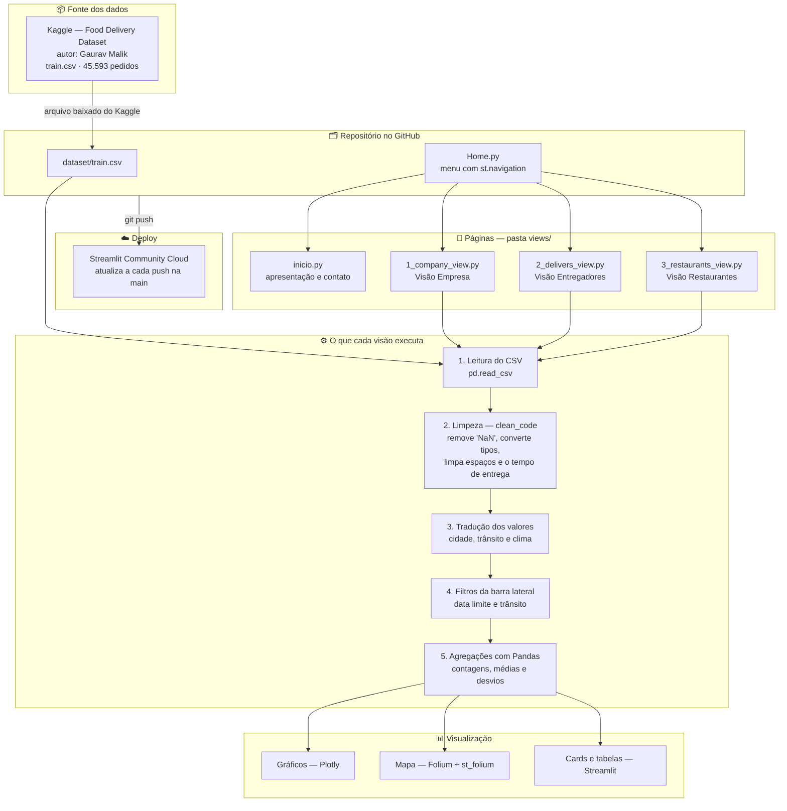

# Cury Company : Growth Dashboard


Dashboard em **Python + Streamlit** com os principais indicadores de um marketplace de delivery de comida, sob três visões: **empresa, entregadores e restaurantes**.

🔗 **Dashboard online:** https://curycompany1.streamlit.app

- Dados reais de **45.593 pedidos** de delivery na Índia (Kaggle), de 11/02/2022 a 06/04/2022.
- Limpeza e agregações com **Pandas**, gráficos com **Plotly**, mapa com **Folium**, app com **Streamlit**.
- Publicado no **Streamlit Community Cloud**, com atualização automática a cada push.

---

## 1. Problema

A Cury Company conecta restaurantes, entregadores e clientes e gera muitos dados operacionais, mas o CEO não tem uma visão centralizada dos indicadores. O objetivo foi reunir os KPIs num único dashboard, em três visões:

| Visão | Responde |
|---|---|
| **Empresa** | Pedidos por dia e por semana, divisão por trânsito e tipo de cidade, mapa das entregas |
| **Entregadores** | Idade, condição dos veículos, avaliações por trânsito e clima, mais rápidos e mais lentos |
| **Restaurantes** | Entregadores únicos, distância média, tempo de entrega com e sem festival, por cidade e trânsito |

---

## 2. Arquitetura


```mermaid
flowchart TB
    subgraph Fonte["📦 Fonte dos dados"]
        A["Kaggle — Food Delivery Dataset<br/>autor: Gaurav Malik<br/>train.csv · 45.593 pedidos"]
    end

    subgraph Repo["🗂️ Repositório no GitHub"]
        B["dataset/train.csv"]
        C["Home.py<br/>menu com st.navigation"]
    end

    subgraph Paginas["📄 Páginas — pasta views/"]
        P0["inicio.py<br/>apresentação e contato"]
        P1["1_company_view.py<br/>Visão Empresa"]
        P2["2_delivers_view.py<br/>Visão Entregadores"]
        P3["3_restaurants_view.py<br/>Visão Restaurantes"]
    end

    subgraph Processo["⚙️ O que cada visão executa"]
        D["1. Leitura do CSV<br/>pd.read_csv"]
        E["2. Limpeza — clean_code<br/>remove 'NaN', converte tipos,<br/>limpa espaços e o tempo de entrega"]
        F["3. Tradução dos valores<br/>cidade, trânsito e clima"]
        G["4. Filtros da barra lateral<br/>data limite e trânsito"]
        H["5. Agregações com Pandas<br/>contagens, médias e desvios"]
    end

    subgraph Saida["📊 Visualização"]
        I["Gráficos — Plotly"]
        J["Mapa — Folium + st_folium"]
        K["Cards e tabelas — Streamlit"]
    end

    subgraph Deploy["☁️ Deploy"]
        L["Streamlit Community Cloud<br/>atualiza a cada push na main"]
    end

    A -->|"arquivo baixado do Kaggle"| B
    C --> P0
    C --> P1 & P2 & P3
    P1 & P2 & P3 --> D
    B --> D
    D --> E --> F --> G --> H
    H --> I & J & K
    Repo -->|"git push"| L
```

**Como funciona:** o `Home.py` só monta o menu. Cada visão lê o CSV, limpa, traduz os valores, aplica os filtros e desenha os gráficos. Os valores são traduzidos logo depois da limpeza para os dados e as opções do filtro usarem os mesmos nomes. Cada visão repete a leitura e a limpeza. As páginas ficam independentes, mas o código se repete e, como o Streamlit roda o script de novo a cada clique, o CSV é reprocessado a cada interação.

---

## 3. Stack

| Ferramenta | Para que foi usada |
|---|---|
| Python 3.12 | Todo o projeto |
| Pandas e NumPy | Limpeza, filtros e agregações |
| Haversine | Distância em linha reta (km) entre restaurante e entrega |
| Plotly | Gráficos de barras, linhas, pizza e sunburst |
| Folium + streamlit-folium | Mapa interativo |
| Streamlit | Interface, filtros e menu (`st.navigation`) |
| Streamlit Community Cloud | Deploy |
| Git e GitHub | Versionamento |

Versões exatas no [`requirements.txt`](requirements.txt).

**Skills demonstradas:** limpeza de dados, visualização de dados, definição de KPIs, análise geoespacial, desenvolvimento de dashboard e deploy de aplicação.

---

## 4. Implementação


**Início:** menu em português e guia rápido das visões.


**Visão Empresa : Gerencial:** pedidos por dia, participação por trânsito e pedidos por cidade e trânsito.


**Visão Empresa : Tática:** pedidos por semana e pedidos por entregador por semana.


**Visão Empresa : Geográfica:** cada marcador é a **mediana** da localização das entregas por tipo de cidade e trânsito. Mediana, e não média, por ser menos sensível a coordenadas fora do padrão.


**Visão Entregadores:** idade, condição do veículo e avaliação média por entregador, trânsito e clima.


**Visão Entregadores:** os 10 mais rápidos e os 10 mais lentos de cada tipo de cidade.


**Visão Restaurantes:** entregadores únicos, distância média e tempo de entrega com e sem festival.


**Visão Restaurantes:** distância média por cidade e tempo médio e desvio por cidade e trânsito.

**Rodar localmente:**

```bash
git clone https://github.com/iannfava/strategic-dashboard-streamlit.git
cd strategic-dashboard-streamlit
pip install -r requirements.txt
streamlit run Home.py
```

```
strategic-dashboard-streamlit/
├── dataset/train.csv   # dados do Kaggle
├── images/             # logo e prints do README
├── views/              # inicio.py e as 3 visões
├── Home.py             # ponto de entrada: menu com st.navigation
└── requirements.txt
```

---

## 5. Resultado

### Principais insights

1. **A cidade metropolitana concentra a operação:** cerca de 77% dos 41.611 pedidos após a limpeza (31.967). As semiurbanas têm só 152.
2. **Festivais coincidem com entregas mais lentas, mas mais previsíveis:** 45,52 min em média (desvio de 4,01) contra 26,16 min sem festival (desvio de 9,0). É uma correlação, não uma causa: trânsito e volume de pedidos podem explicar a diferença.
3. **Cidades semiurbanas têm as entregas mais demoradas** (47 a 50 min) e nenhum pedido com trânsito Baixo, mas com só 152 pedidos isso é uma observação, não uma conclusão.

### O que eu fiz além do curso

- **Consertei o deploy:** o `requirements.txt` era um `pip freeze` com `pywin32`, que não instala no servidor Linux. Reduzi às 8 bibliotecas que o código importa.
- **Corrigi um bug silencioso:** o top 10 procurava `Metropolitan`, mas o dataset escreve `Metropolitian`, e a cidade sumia das tabelas sem erro.
- **Corrigi os cards da Visão Restaurantes:** rótulos trocados, um desvio que repetia a média e falta de unidades.
- **Traduzi o app** para português, com os filtros funcionando, e montei o menu com `st.navigation`.
- **Fiz o filtro de data ler as datas reais dos dados**, em vez de datas digitadas no código.
- **Limpei o repositório** e reescrevi este README só com o que verifiquei no código e nos dados.

### Limitações

- O dataset não documenta o critério dos tipos de cidade, e cada tipo reúne várias cidades reais. Por isso os marcadores do mapa ficam no centro do país.
- A condição do veículo (0 a 3) não tem escala documentada, então o dashboard mostra só o maior e o menor valor.
- A limpeza remove cerca de 9% das linhas (de 45.593 para 41.611).
- A distância é em linha reta, não pelo trajeto real.
- Falta parte do fim de fevereiro nos dados, e a primeira e a última semana estão incompletas.

### Próximos passos

- Centralizar a leitura e a limpeza num módulo com cache (`st.cache_data`).
- Fazer um mapa por cidade real, extraindo a cidade do ID do entregador (ex.: `MUMRES`, `BANGRES`), o que ainda precisa ser confirmado.
- Investigar os registros que a limpeza remove (idades de 15 e 50 anos, condição de veículo 3).
- Adicionar filtros por tipo de cidade e clima.

---

## Dados e créditos

- **Dataset:** [Food Delivery Dataset](https://www.kaggle.com/datasets/gauravmalik26/food-delivery-dataset), de Gaurav Malik, no Kaggle. Uso educacional; a página do dataset não especifica a licença.
- **Curso:** projeto desenvolvido no curso da Comunidade DS.

## Contato

- **LinkedIn:** [linkedin.com/in/iannfava](https://linkedin.com/in/iannfava)
- **GitHub:** [github.com/iannfava](https://github.com/iannfava)
- **E-mail:** iannfava@gmail.com
